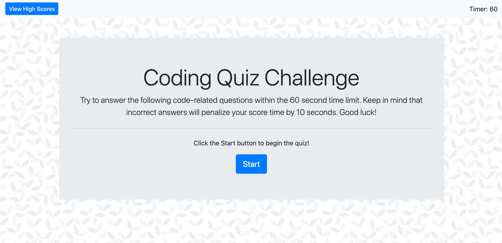

# Code Quiz

</>

For this assignment, I've created a 6 question multiple-choice quiz on JavaScript fundamentals. Upon clicking the Start button, the user has 60 seconds to answer the questions. For each incorrect answer, 10 seconds is deducted from the timer. Once the user answers all 6 questions or the timer hits 0, they are notified of their final score. They are also prompted to enter their initials to record thier time to the Highscores board, which can be viewed at any time. Technologies used include HTML, CSS, and JavaScript. 

https://jeniglar.github.io/CodeQuiz/

jeniglar@gmail.com
